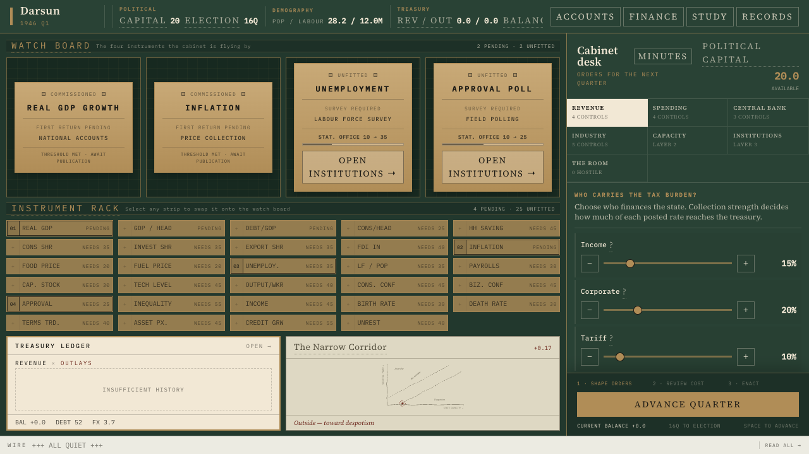

# Terrarium

Terrarium is a browser-based economic policy game about governing a country you cannot see
clearly. Each quarter you set taxes, spending rules, monetary and financial policy, invest in
state capacity, and attempt reforms while official statistics arrive late, noisy, and subject to
revision.

The simulation is systemic rather than scripted: a five-sector, five-cohort economy connects
production, trade, finance, technology, demography, and migration, while institutions and social
blocs turn economic outcomes into political power, favour, elections, coups, and revolts.



The current build is playable end to end. Choose a curated, procedural, or player-authored
country; take office in 1946 or inherit it later in the century; and govern quarterly through
2050. Runs are deterministic and replayable from their materialized country, seed, standing
orders, appointment, and action log. Saves are stored in IndexedDB and can be exported or
imported as JSON.

## Play it

Requires Node.js 24 or later and pnpm 10.

```sh
pnpm install
pnpm dev        # http://localhost:5173
```

Choose a posting, read the instrument wall, stage orders in the cabinet, and advance one quarter
at a time. Investing in the state improves what the government can measure and deliver; the fog
never disappears by itself.

## Read the design

- [Game description](docs/game-description.md) — the short pitch and design pillars.
- [Working design](docs/proposal-1.md) — the mechanics and rationale referenced by the code.
- [Technical architecture](docs/tech-architecture.md) — packages, state, pipeline, tests, and
  persistence as they exist now.
- [Country scenarios](docs/country-scenarios.md) — authored and procedural countries, later
  appointments, and calibration evidence.
- [Architecture decisions](docs/adr/README.md) — accepted decisions, alternatives, and costs.
- [Metrics changelog](docs/metrics-changelog.md) — the versioned engine input/output contract.

Superseded planning documents are retained for provenance in
[docs/archive/](docs/archive/README.md) and are not maintained as current documentation.

## Workspace

| Package | What it is |
| --- | --- |
| `packages/engine` | Pure, deterministic simulation: country recipes, actions, state, and the quarterly pipeline. |
| `packages/observation` | Presentation-only projection of engine-made releases into `PublishedState`, the only state the UI may see. |
| `packages/ui` | React instrument wall and cabinet. A Web Worker is the only host that runs the engine. |
| `packages/runner` | Headless batch and long-horizon stability tools for model calibration. |
| `packages/fixtures` | Shared country inputs and named policy scripts used by tests and runners. |
| `packages/architecture-visualizer` | Code-derived atlas of pipeline order, package seams, and module relationships. |

The dependency direction is lint-enforced:

```text
ui → observation → engine
```

## Develop and validate

```sh
pnpm test          # unit, golden, property, contract, and pure UI suites
pnpm typecheck
pnpm lint          # architectural boundaries and deterministic-runtime rules included
pnpm coverage      # tests plus the 80% floor over the pure core
pnpm test:visual   # Playwright screenshots, layout, overflow, and accessibility checks

pnpm batch -- --runs 1000 --ticks 120 --policy random
pnpm stability -- --runs 120 --policy all --country all
pnpm architecture  # scan the source and open the engine atlas
```

The validation strategy matches the kind of claim being made: exact golden replays catch any
state movement, statistical properties and runners test behavior across seeds and countries,
contract tests protect the fog boundary, and Playwright checks the rendered war room in a real
browser. CI gates changes on typechecking, lint, coverage, and a 200-run random-policy balance
smoke test.

Before accepting an intentional engine change, inspect `pnpm diff-state -- --moved-only`; only
then does `pnpm bless` update the golden replays.
